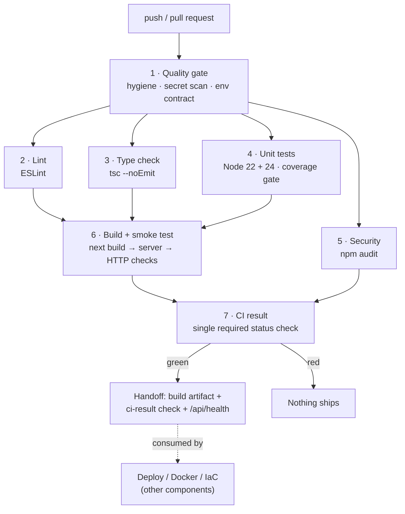

# CI Pipeline — AidPulse SG

Everything the automated pipeline does, why each gate exists, how to run it locally,
and how to demo it. Owner: the CI component.

Deployment, containerisation and infrastructure are separate components owned by
other members; §4 is the handoff contract between them and CI.

- Workflow file: [`.github/workflows/ci.yml`](../.github/workflows/ci.yml)
- Live runs: **Actions** tab → *CI*
- Health probe used by the pipeline: [`app/api/health/route.ts`](../app/api/health/route.ts)

---

## 1. What the pipeline is for

Before this existed, "does it work?" was answered by one person running the app on
one laptop. Now every push and every pull request is verified the same way, on a
clean machine, in about four minutes — and `main` is only ever deployed from a
commit that passed all of it.

The pipeline enforces four promises:

| Promise | Enforced by |
|---|---|
| No secret ever reaches the repository | Stage 1 — credential scan over every tracked file |
| The code compiles and obeys the project's rules | Stages 2 + 3 — ESLint and strict `tsc` |
| The logic behaves as specified, on every supported runtime | Stage 4 — 76 unit tests on Node 22 and 24, with a coverage floor |
| The application actually boots and serves traffic | Stage 6 — production build, real server, real HTTP requests |

---

## 2. The pipeline at a glance



Stages 2–5 run in parallel; stage 6 waits for them. Stage 7 always runs, so the
summary table is published even when something failed.

---

## 3. Stage by stage

### 1 · Quality gate — `quality`

Cheap checks, no `npm install`, so mistakes that matter fail within ~20 seconds.

| Check | Fails when |
|---|---|
| No committed `.env` | A real `.env`/`.env.local` is tracked by git |
| No committed build output | `node_modules/`, `.next/` or `out/` is tracked |
| Lockfile present | `package-lock.json` is missing (`npm ci` would be non-reproducible) |
| Credential scan | A tracked file matches a Twilio SID, a Supabase service key, a JWT, or a PEM private key |
| Env-var contract | Code reads a `process.env.X` that `.env.example` does not document |

The last one is the one that has saved real deployments: a new environment
variable that works locally but was never added to Vercel produces a 500 in
production. Now it fails in CI instead, on the commit that introduced it.

### 2 · Lint — `lint`

ESLint (`next/core-web-vitals` + TypeScript rules) with a reporting layer:
[`.github/scripts/eslint-summary.mjs`](../.github/scripts/eslint-summary.mjs) reads
ESLint's JSON output, publishes a **per-rule error/warning table** in the run
summary, annotates each offending line so it shows up in the PR diff, and owns the
job's exit code. ESLint itself runs with `|| true` precisely so the report is
published on a red run instead of being swallowed by "exit code 1".

**React Compiler policy.** `eslint-config-next` 16 ships the React Compiler's
`react-hooks` rules as errors. Three of them — `react-hooks/set-state-in-effect`,
`react-hooks/refs` and `react-hooks/purity` — fire across existing components,
mostly providers that hydrate their state from `localStorage` inside an
effect. Those are performance/idiom advisories about a pattern that works, and
fixing them means restructuring hydration in several components owned by other
team members. They are downgraded to **warnings** in
[`eslint.config.mjs`](../eslint.config.mjs): still counted and reported on every
run, but not a merge blocker. Every other rule — `rules-of-hooks` included — stays
an error, so anything new that breaks still fails the build.

### 3 · Type check — `typecheck`

`npm run typecheck` → `tsc --noEmit` over the whole project.

This gate exists because [`next.config.ts`](../next.config.ts) sets
`typescript.ignoreBuildErrors: true` so that deployments are not blocked by
third-party typing gaps. That is a pragmatic deploy setting, but it means the
production build type-checks nothing. The pipeline restores the check where it
belongs: on every commit, without blocking the deploy path.

Because `next-env.d.ts` is generated (and gitignored), the job recreates it before
running `tsc` — a clean checkout has no Next.js ambient types otherwise.

### 4 · Unit tests — `test`

`npm run test:ci` on **Node 22 and Node 24**, in parallel.

- **Zero dependencies.** The suite uses Node's built-in test runner (`node:test`)
  and native TypeScript type stripping — no Jest, no Vitest, no transpile step, and
  nothing added to `package-lock.json`. Tests import the real source file
  (`./email-otp.ts`) and run it exactly as shipped.
- **Two runtimes.** The suite depends on native type stripping, so it runs on both
  supported Node majors. That proves the project is not pinned to one developer's
  local runtime.
- **Coverage is a gate, not a report.** The run fails below **85% lines, 75%
  branches, 85% functions** (test files excluded from the measurement). The suite
  currently sits at ~95% lines / ~84% branches / ~94% functions, so the floor has
  headroom but still bites the moment untested code lands in a covered module. An
  `lcov` report is uploaded as an artifact on every run, and the coverage table is
  published to the run summary.

What is covered, and why these modules:

| Test file | Module under test | Why it is worth testing |
|---|---|---|
| [`lib/email-otp.test.ts`](../lib/email-otp.test.ts) | Stateless e-mail OTP token | The HMAC token is the only thing preventing a forged e-mail verification. Covers wrong code, foreign e-mail, tampered signature, malformed token, expiry, and that the code is not recoverable from the token. |
| [`lib/otp-rate-limit.test.ts`](../lib/otp-rate-limit.test.ts) | SMS send throttle | Every SMS costs money; a bug here is a billing incident. Covers the 30-second gap, the 5-per-hour cap, window reset, and key isolation — using a mocked clock, so an hour of behaviour is tested in milliseconds. |
| [`lib/auth.test.ts`](../lib/auth.test.ts) | Phone-OTP auth seam | Real Twilio path vs. the demo fallback, and the client-side guards that must never hit the network. *(pre-existing)* |
| [`lib/news-feed.test.ts`](../lib/news-feed.test.ts) | Live news aggregator | The only place the app parses untrusted third-party XML. Covers CDATA/entity decoding, publisher attribution, the health filter, cross-source de-duplication, newest-first ordering, `og:image` resolution, and graceful degradation when a source 500s or the network is down. |
| [`lib/certificate-ai.test.ts`](../lib/certificate-ai.test.ts) | Certificate analyser + opportunity matcher | The on-device fallback that keeps volunteer registration working without the Gemini webhook, plus the ranking and "why this matches you" reasons volunteers actually see. |
| [`lib/beds.test.ts`](../lib/beds.test.ts) | Officer bed edits → map | A rounding or clamping bug here is a wrong bed count on an emergency map. Covers recomputation, clamping, unknown wards, immutability, and the zero-bed division case. |
| [`app/api/chat/extract-reply.test.ts`](../app/api/chat/extract-reply.test.ts) | n8n reply extraction | The webhook can answer in several shapes. *(pre-existing)* |

### 5 · Security — `security`

`npm audit --json`, parsed by the job rather than trusted for its exit code:

- **critical** advisories → the pipeline **fails**.
- **high** and below → reported in the run summary as a warning.

The split is deliberate: a critical advisory is a stop-everything event, whereas
blocking a demo on a moderate transitive advisory that has no fix available yet
would train the team to ignore the pipeline. The full JSON report is uploaded as
an artifact.

### 6 · Build + smoke test — `build`

The stage that answers "does the application actually run?":

1. `npm run build` — the real production build.
2. `npm start` — the real production server, in the background.
3. Poll `GET /api/health` until it answers (max 60 s), then assert `status: "ok"`.
4. `GET /` must return **200**.
5. An unknown path must return **404** — proof that routing is real and the server
   is not just answering 200 to everything.

The build output (`.next`, minus the cache) is uploaded as the artifact
`next-build-<sha>`: the exact bytes that passed, available for download or for a
deploy/containerisation workflow to consume (see §4).

`.next/cache` is restored from the Actions cache between runs, keyed on the
lockfile plus the source tree, so repeat builds are minutes faster.

### Failures explain themselves

Every stage that can fail with a wall of output — lint, type check, tests, build —
tees its log and republishes it through
[`.github/scripts/annotate-log.mjs`](../.github/scripts/annotate-log.mjs) as GitHub
annotations plus a collapsible block in the run summary (in 4 KB chunks, because
GitHub truncates a single annotation). The failing assertion or rule appears on the
commit and in the PR "Checks" tab, so nobody has to open a raw log to find out what
broke. On a green test run the same mechanism publishes the coverage table, as
evidence that the coverage gate really ran.

### 7 · CI result — `ci-result`

One job that depends on all the others, runs even when they fail, publishes the
summary table, and exits non-zero if anything upstream failed.

Branch protection points at this single check, so adding a stage never means
reconfiguring the protected-branch rules.

---

## 4. Handoff to the other DevOps components

CI stops at "this commit is proven good". Deployment, containerisation and
infrastructure are owned by other members, so this section is the **contract**
between them: what CI publishes, and how to consume it without either side having
to modify the other's files.

### What CI publishes for you

| Output | Where | Use it for |
|---|---|---|
| `next-build-<sha>` artifact | Actions → the run → Artifacts (`.next`, minus cache) | The exact bytes that passed. A Docker image build or a deploy can download this instead of rebuilding. |
| `ci-result` status check | The commit / PR | The one check to gate on. Depend on it and you can never ship an unverified commit. |
| `GET /api/health` | The running app | Kubernetes **liveness/readiness probe**, an Ansible post-deploy assertion, or a Jenkins smoke stage. Returns `status`, `commit`, `environment`, and booleans for each integration — never a secret value. |
| `workflow_call` on `ci.yml` | `.github/workflows/ci.yml` | Reuse the whole pipeline from another workflow instead of duplicating the gates. |

### How to chain onto CI

```yaml
# In YOUR workflow (deploy.yml / docker.yml / k8s.yml — any name but ci.yml):
on:
  workflow_run:
    workflows: [CI]        # this workflow's `name:` field
    types: [completed]
    branches: [main]

jobs:
  deploy:
    # The gate: a red CI run never reaches here.
    if: github.event.workflow_run.conclusion == 'success'
    runs-on: ubuntu-latest
    steps:
      - uses: actions/download-artifact@v5
        with:
          name: next-build-${{ github.event.workflow_run.head_sha }}
          run-id: ${{ github.event.workflow_run.id }}
          github-token: ${{ secrets.GITHUB_TOKEN }}
      # …your deploy / docker build / helm upgrade …
```

Note that GitHub only fires `workflow_run` for workflow files that already exist on
the **default branch** — your chained workflow stays dormant until it is merged to
`main`.

### Interaction points to know about

None of these block anyone today (no Docker, Ansible, Jenkins or Kubernetes files
exist in the repo yet), but they are where CI and the other components will meet:

| Point | What happens | If it gets in your way |
|---|---|---|
| **Secret scan** reads *every* tracked file | A Kubernetes `Secret` manifest or an Ansible file containing a real Supabase JWT (`eyJhbGciOi…`), a Twilio SID, or a PEM private key will fail stage 1 | That is the gate doing its job — use a sealed secret / `ansible-vault` / a CI secret instead. If you have a legitimate exception, add a path to the exclusion list in `ci.yml` (`git ls-files -- . ':!:…'`) |
| **CI branch triggers** are `main`, `feature/**`, `fix/**`, `chore/**` | A push to e.g. `docker` or `k8s-setup` gets **no CI at all** | Name your branch `feature/docker`, or ask the CI owner to add your prefix |
| **ESLint and `tsc` run repo-wide** | A `.js`/`.ts` helper you add anywhere is linted and type-checked | Groovy (`Jenkinsfile`), YAML, Dockerfiles and shell are not touched. For JS tooling, either follow the rules or ask to have the path scoped out |
| **Dependencies are frozen** | CI added **zero** packages — `package-lock.json` is untouched | `npm ci` in a Dockerfile builds the identical tree it did before CI existed |
| **Workflow file names** | CI owns `ci.yml` only | Any other file name is yours; just don't reuse the `ci-*` concurrency group prefix |

> **Scope note.** A deploy-gate workflow was written and then removed from this
> branch on purpose: deployment is another member's component. The chaining
> example above is the CI side of that boundary — it does not deploy anything.

---

## 5. Running the pipeline locally

The same gates, in the same order, in one command:

```bash
npm run ci
```

Or individually:

```bash
npm run lint
npm run typecheck
npm test
npm run test:coverage
npm run build
```

Watch mode while writing a test:

```bash
npm run test:watch
```

Requires **Node 22.18+ or Node 24+** (native TypeScript type stripping). Check with
`node -v`.

---

## 6. Repository setup (one-time)

**Branch protection** — Settings → Branches → add a rule for `main`:

- Require a pull request before merging
- Require status checks to pass → select **CI result**
- Require branches to be up to date before merging

**Optional variables** — Settings → Secrets and variables → Actions:

| Name | Kind | Purpose |
|---|---|---|
| `PRODUCTION_URL` | Variable | URL the CD verification targets (defaults to `https://aidpulsesg.vercel.app`) |
| `VERCEL_TOKEN` | Secret | Switches CD to pipeline-owned deploys |
| `VERCEL_ORG_ID` | Secret | Vercel organisation id |
| `VERCEL_PROJECT_ID` | Secret | Vercel project id |

No secret is required for CI itself — the build runs with none, which is exactly
why the smoke test is meaningful: the app must survive an unconfigured environment.

---

## 7. Demoing it in three minutes

1. **Show the pipeline running.** Actions tab → the newest *CI* run → the job graph.
   Point out stages 2–5 running in parallel and stage 6 waiting on them.
2. **Show the summary.** Scroll to the run summary: the per-stage table, the
   coverage output, and the audit table.
3. **Break it on purpose.** On a branch, change `MAX_PER_WINDOW` in
   [`lib/otp-rate-limit.ts`](../lib/otp-rate-limit.ts) from `5` to `50`, push, and
   watch stage 4 fail with the exact assertion (`the 6th code inside the hour is
   refused`). Revert, push, watch it go green.
4. **Show the gate.** Open a pull request from that branch: the **CI result** check
   blocks the merge button while it is red.
5. **Show the chain.** Merge to `main` → CI runs → CD starts only after CI is green
   → the live URL is verified and the commit is echoed back by `/api/health`.

---

## 8. Troubleshooting

| Symptom | Cause and fix |
|---|---|
| Stage 1 fails on the credential scan | A key was pasted into a tracked file. Rotate it, move it to `.env.local`, and remove it from the commit. |
| Stage 1 fails on the env-var contract | New `process.env.X` in the code. Add a documented placeholder line to `.env.example` — and set the real value in Vercel. |
| Stage 4 fails only on Node 22 | Something used depends on a Node 24-only API. Either polyfill it or raise the matrix floor deliberately. |
| Stage 4 fails on coverage | New uncovered code in an already-covered module. Add the test — that is the gate working. |
| Stage 6 hangs and then fails | The server never became healthy. The job prints `server.log` on failure; read the stack trace there. |
| CD says "still serving `<other sha>`" | The Vercel deploy has not finished. It is a warning, not a failure; re-run *CD* manually to re-verify. |

---

## 9. What the pipeline caught in its first hour

Everything below was found by the pipeline itself, on the branch that introduced
it — none of it was known beforehand. It is the honest answer to "does this
actually do anything?".

| Found by | What it was |
|---|---|
| Stage 3 (type check) | `web-push` ships no type declarations, so `import webpush` was an implicit `any` that silently disabled type checking for the whole broadcast route. Fixed with `types/web-push.d.ts` — no new dependency. |
| Stage 3 (type check) | `lib/push.ts` passed a `Uint8Array<ArrayBufferLike>` where the Push API wants a `BufferSource`. Real type error, invisible before because the production build has type gating turned off. |
| Stage 4 (tests) | Two of the new tests asserted that `matchOpportunities` returns nothing without a skill overlap. It does not: urgency and proximity score independently, so an urgent shift 1.5 km away is surfaced with score 2. **The implementation was right and the test was wrong** — the tests now pin the real contract. |
| Stage 2 (lint) | The CI helper scripts themselves broke the repo's `no-require-imports` rule. The lint gate failing on its own tooling is the gate working; they are ESM now. |
| Stage 6 (build) | `actions/upload-artifact` skips dot-directories by default, so the `.next` artifact uploaded empty even though the build and smoke test passed. |

## 10. Design decisions, and what they cost

| Decision | Why | Trade-off accepted |
|---|---|---|
| Node's built-in test runner instead of Jest/Vitest | No new dependency, no transpile config, tests run the shipped source directly | Fewer conveniences (no snapshot testing, no DOM renderer) — the covered modules are pure logic, so none are needed |
| Test on two Node majors | The suite depends on native type stripping; one runtime would hide runtime-specific breakage | Doubles the test job's runner minutes (still under a minute each) |
| Coverage as a hard gate at 60% | A coverage number nobody enforces is decoration | Must be raised deliberately as coverage grows, or it stops meaning anything |
| Critical `npm audit` fails, high only warns | Keeps the gate credible: it stops real emergencies without blocking a demo on an unfixable transitive advisory | A high-severity issue can be merged if nobody reads the summary |
| Smoke test with a real server, not a mocked one | Unit tests cannot catch a broken build, a bad route, or a boot-time crash | Adds ~1 minute to the pipeline |
| `main` protected behind one aggregate check | Adding a stage never breaks branch protection | One level of indirection when reading a failed run |
